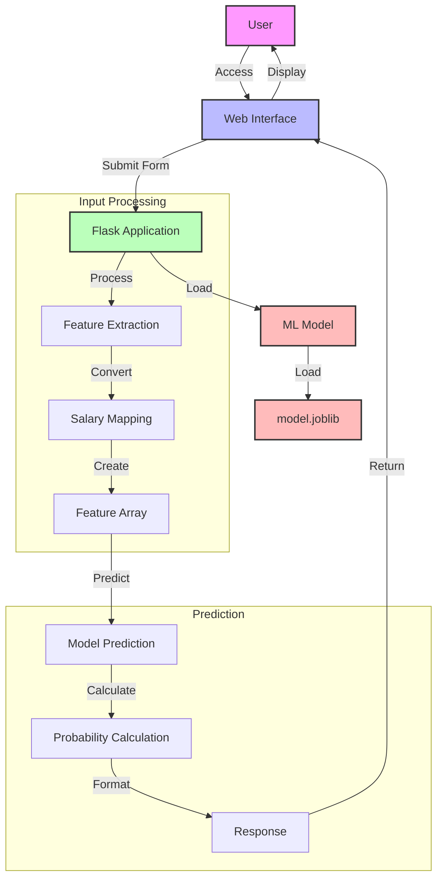

## System Flow Description

1. **User Interface**
   - Users access the web interface through their browser
   - Interface collects employee data through a form

2. **Flask Application**
   - Handles HTTP requests and responses
   - Manages the prediction workflow
   - Loads the pre-trained ML model

3. **Input Processing**
   - Extracts features from form data
   - Maps salary categories (low/medium/high) to numerical values
   - Creates feature array for model input

4. **Prediction Pipeline**
   - Model makes prediction using input features
   - Calculates probability of employee staying/leaving
   - Formats response with probabilities

5. **Response**
   - Returns JSON response with prediction results
   - Displays results to user through web interface

## Technical Components

- **Frontend**: HTML/CSS/JavaScript (templates)
- **Backend**: Flask (Python)
- **ML Model**: Pre-trained model (model.joblib)
- **Data Processing**: NumPy for array operations
- **Model Persistence**: Joblib for model storage 